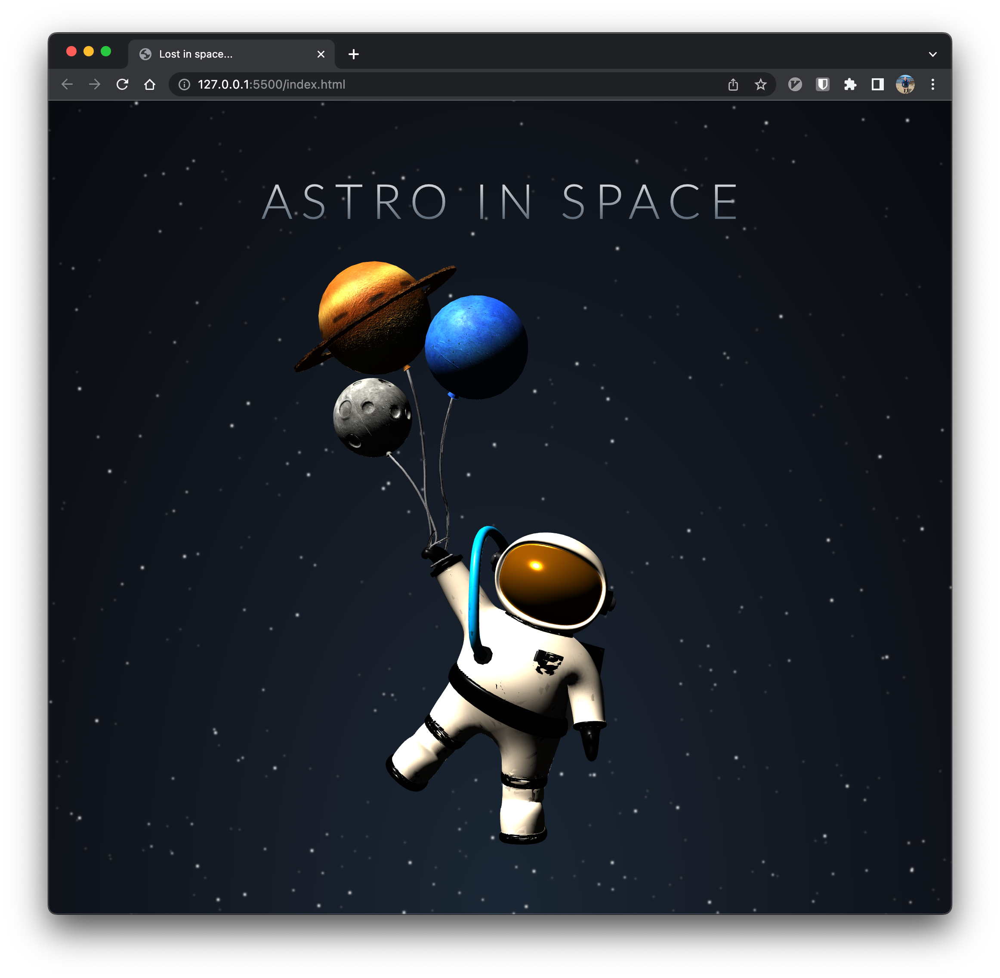

# Floating Astronaut

Floating astronaut is a non-interactive project made with [three.js](https://threejs.org/). The lighting and animation is done using three.js, whilst the space background is made with css and java-script. The stars were created with randomized drop-shadows on three different sized div elements.

Model Information:
* title:	Little Astronaut - Animation Character
* source:	https://sketchfab.com/3d-models/little-astronaut-animation-character-847c254564b4476bb4da87df59ea540c
* author:	gozdemrl (https://sketchfab.com/gozdemrl)
* license type:	CC-BY-4.0 (http://creativecommons.org/licenses/by/4.0/)

